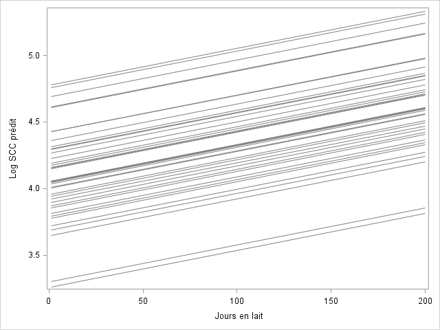
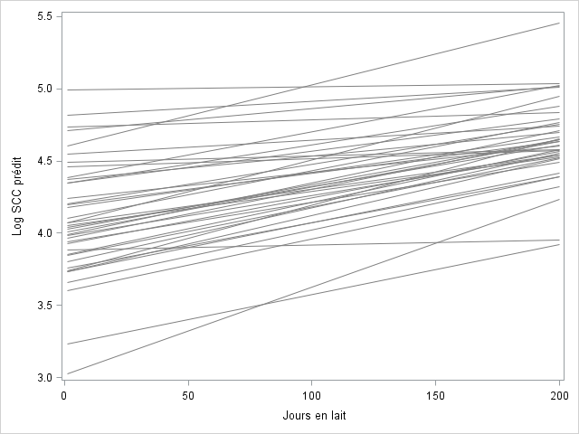

```{r include=FALSE}
# automatically create a bib database for R packages
knitr::write_bib(c(
  .packages(), 'bookdown', 'knitr', 'rmarkdown'
), 'packages.bib')
```


# Modèles mixtes pour données structurées  
  
## Généralités  
  
Les données sont structurées lorsque les observations partagent des caractéristiques communes. Les observations provenant d’un même regroupement sont habituellement « plus semblables ». Elles sont plus semblables parce que les observations partagent un environnement commun (e.g., un enclos), un espace commun (e.g., topographie), un regroupement temporel (e.g., des mesures répétées sur un même individu). Cette structure résulte souvent de votre échantillonnage. Par exemple, si vous échantillonez les 4 glandes mammaires de chacune des vaches de 30 troupeaux, vous devrez probablement prendre en compte le fait que les glandes mammaires sont regroupées par vache qui, elles-mêmes sont regroupées par troupeau. Les observations, dans ce cas, ne sont plus **indépendantes** les unes des autres (une condition essentielle pour plusieurs approches statistiques).
  
Si on ignore le regroupement des données lors des analyses statistiques, les erreurs types des paramètres seront souvent trop petites pour les prédicteurs au niveau du groupe, mais parfois trop grandes pour les prédicteurs au niveau individuel et un poids déraisonnable pourrait être attribué aux groupes les plus larges. Un exemple de données structurée est illustré dans la figure suivante.  
  
  
  
Les modèles mixtes (mixed models) « prolongent » les modèles de régression linéaire et les modèles de régression linéaire généralisés pour prendre en considération, lors des analyses statistiques, le regroupement des données. On les dit « mixtes » parce qu’ils comprennent à la fois des effets fixes (les prédicteurs) et aléatoires (des intercepts et/ou des pentes aléatoires). On les appelle aussi modèles à effets aléatoires (random effects models) ou modèles à variance groupée (variance component models). Les modèles multi-niveaux ou hiérarchiques sont des cas particuliers des modèles mixtes où chaque niveau est parfaitement imbriqué dans le niveau supérieur (comme à la figure précédente).  
  
Dans `R`, plusieurs librairies ont été conçues spécifiquement pour réaliser les différents modèles mixtes, les librairies `nlme` et `lme4` sont probablement les plus utilisées. Brièvement:  
- La librairie **`nlme`** ne pourra être utilisée que pour les **modèles linéaires mixtes** (i.e., les modèles où la variable dépendante est quantitative et normalement distribuée, mais où des regroupements d'observations doivent être pris en compte);  
- La librairie **`lme4`** permettra de réaliser les **modèles linéaires généralisés mixtes** (i.e., les modèles où la variable dépendante peut être binaire, un compte d'événements, ou autre, et permettant de choisir différentes fonction de lien tel logit, log, etc, et, encore une fois, où des regroupements d'observations doivent être pris en compte).  
  
Dans les exemples suivants, nous verrons seulement des cas où la variable dépendante est quantitative et normalement distribuée. Nous utiliserons donc la librairie `nlme`.  
  
Notez que l’estimation des modèles linéaires généralisés mixtes (i.e., les modèles de régression mixtes pour une variable dépendante autre que quantitative normale) présente de nombreuses difficultés :  
1) plusieurs des méthodes disponibles sont reconnues pour produire des estimés des coefficients, des erreurs types et des variances qui sont biaisées (Joe, H., 2008)[^8];  
2) des procédures itératives sont utilisées afin de solutionner ces modèles et tout message indiquant un problème de « convergence » de la méthode devraient être pris très au sérieux.  
  
[^8]: [Joe. H., 2008. Accuracy of Laplace approximation for discrete response mixed models. Computational Statistics & Data Analysis](https://www.sciencedirect.com/science/article/pii/S0167947308002533)  
  
  
## Évaluer la structure de regroupement  
  
Une première étape primordiale lorsque vous travaillez avec des données structurées est de représenter dans un schéma comme à la figure précédente la structure hypothétique de vos données. Dans ce schéma vous indiquerez aussi à quel niveau se situe chacun de vos prédicteurs et votre variable dépendante (cette dernière sera souvent, mais pas toujours, au niveau le plus bas de la hiérarchie).  
  
Après avoir établi ce schéma, vous pourrez ensuite calculer le nombre moyen d’observations par niveau supérieur et l’étendue du nombre d’observations par niveau supérieur. Vous pourrez ainsi vérifier si certains niveaux sont superflus (e.g., une seule ou peu d’observations par groupe pour ce niveau) ou s’ils pourront être traités autrement que par un effet aléatoire (e.g., groupe inclus comme effet fixe). En fait, vous voudrez établir un tableau similaire au tableau suivant.  

```{r echo=FALSE, warning=FALSE, message=FALSE}
#Nous importons le jeu de données
reu_cfs <- read.csv(file="reu_cfs.csv", 
                    header=TRUE, 
                    sep=";"
                    )
#Nous indiquons les variables catégoriques dans le jeu de données
reu_cfs$region <- factor(reu_cfs$region) 
reu_cfs$herd <- factor(reu_cfs$herd) 
reu_cfs$cow <- factor(reu_cfs$cow) 
reu_cfs$fscr <- factor(reu_cfs$fscr)
reu_cfs$heifer <- factor(reu_cfs$heifer)
reu_cfs$ai <- factor(reu_cfs$ai) 

#Nombre total de lactations
dimension <- dim(reu_cfs)
total <- dimension[1]

#Nombre moyen et étendue des lactations par vache
#1) Créer un jeu de données "vaches" où les lactations ont été compilées par vache 
library(dplyr)
vaches <- reu_cfs %>%
  count(cow)
#Dans ce jeu de données, la variable n représente le nombre de lactations suivies par vache. Nous pouvons donc obtenir la moyenne et l'étendue (minimum et maximum)
dimension <- dim(vaches)
nb_vache <- dimension[1]
mean_lact <- round(mean(vaches$n),
                   digits=1
                   )
min_lact <- min(vaches$n)
max_lact <- max(vaches$n)

#2) créer un jeu de données "troupeaux" où les vaches sont regroupées par troupeau. Pour ce faire, on devra procéder en 2 étapes, en regroupant d'abord par troupeau, puis en comptant le nombre de troupeaux:
troupeaux <- reu_cfs %>%
  group_by(herd) %>%
  count(cow)
troupeaux <- troupeaux %>%
  count(herd)
#Dans ce jeu de données, la variable n représente le nombre de vaches par troupeau. Nous pouvons donc obtenir la moyenne et l'étendue (minimum et maximum)
dimension <- dim(troupeaux)
nb_troupeau <- dimension[1]
mean_vache <- round(mean(troupeaux$n),
                   digits=1
                   )
min_vache <- min(troupeaux$n)
max_vache <- max(troupeaux$n)

#3) Créer un jeu de données "région" où... (vous aurez compris la suite)
region <- reu_cfs %>%
  group_by(region) %>%
  count(herd)
region <- region %>%
  count(region)
#Dans ce jeu de données, la variable n représente le nombre de troupeaux par région. Nous pouvons donc obtenir la moyenne et l'étendue (minimum et maximum)
dimension <- dim(region)
nb_region <- dimension[1]
mean_troupeau <- round(mean(region$n),
                   digits=1
                   )
min_troupeau <- min(region$n)
max_troupeau <- max(region$n)

#Il ne reste plus qu'à assembler toutes ces informations dans une table
ligne_titre <- c("Niveau", "Nombre d'unités", "Nombre moyen/niveau supérieur", "Minimum/niveau supérieur", "maximum/niveau supérieur")
ligne_lact <- c("Lactation", total, mean_lact, min_lact, max_lact)
ligne_vache <- c("Vaches", nb_vache, mean_vache, min_vache, max_vache)  
ligne_troupeau <- c("Troupeau", nb_troupeau, mean_troupeau, min_troupeau, max_troupeau) 
ligne_region <- c("Region", nb_region, " ", " ", " ") 

Structure <- data.frame(rbind(ligne_titre, ligne_region, ligne_troupeau, ligne_vache, ligne_lact))
rownames(Structure) <- NULL
colnames(Structure) <- NULL

library(knitr)
library(kableExtra)
kable(Structure, 
      caption="Structure des données reu_cfs.csv",
      align = "lccc")%>%
  kable_styling()

```
  
Vous pouvez calculer les différents éléments nécessaires pour compléter ce genre de table en utilisant différentes fonctions `R` de base. Par exemple, pour cette table représentant les données d'une étude où l'unité d'analyse était les lactations, de vaches, de différents troupeaux, dans 5 régions, nous avons utilisé le (long) code `R` suivant.  
  
```{r eval=FALSE}
#Nous importons le jeu de données
reu_cfs <- read.csv(file="reu_cfs.csv", 
                    header=TRUE, 
                    sep=";"
                    )
#Nous indiquons les variables catégoriques dans le jeu de données
reu_cfs$region <- factor(reu_cfs$region) 
reu_cfs$herd <- factor(reu_cfs$herd) 
reu_cfs$cow <- factor(reu_cfs$cow) 
reu_cfs$fscr <- factor(reu_cfs$fscr)
reu_cfs$heifer <- factor(reu_cfs$heifer)
reu_cfs$ai <- factor(reu_cfs$ai) 

#Nombre total de lactations
dimension <- dim(reu_cfs)
total <- dimension[1]

#Nombre moyen et étendue des lactations par vache
#1) Créer un jeu de données "vaches" où les lactations ont été compilées par vache 
library(dplyr)
vaches <- reu_cfs %>%
  count(cow)
#Dans ce jeu de données, la variable n représente le nombre de lactations suivies par vache. Nous pouvons donc obtenir la moyenne et l'étendue (minimum et maximum)
dimension <- dim(vaches)
nb_vache <- dimension[1]
mean_lact <- round(mean(vaches$n),
                   digits=1
                   )
min_lact <- min(vaches$n)
max_lact <- max(vaches$n)

#2) créer un jeu de données "troupeaux" où les vaches sont regroupées par troupeau. Pour ce faire, on devra procéder en 2 étapes, en regroupant d'abord par troupeau, puis en comptant le nombre de troupeaux:
troupeaux <- reu_cfs %>%
  group_by(herd) %>%
  count(cow)
troupeaux <- troupeaux %>%
  count(herd)
#Dans ce jeu de données, la variable n représente le nombre de vaches par troupeau. Nous pouvons donc obtenir la moyenne et l'étendue (minimum et maximum)
dimension <- dim(troupeaux)
nb_troupeau <- dimension[1]
mean_vache <- round(mean(troupeaux$n),
                   digits=1
                   )
min_vache <- min(troupeaux$n)
max_vache <- max(troupeaux$n)

#3) Créer un jeu de données "région" où... (vous aurez compris la suite)
region <- reu_cfs %>%
  group_by(region) %>%
  count(herd)
region <- region %>%
  count(region)
#Dans ce jeu de données, la variable n représente le nombre de troupeaux par région. Nous pouvons donc obtenir la moyenne et l'étendue (minimum et maximum)
dimension <- dim(region)
nb_region <- dimension[1]
mean_troupeau <- round(mean(region$n),
                   digits=1
                   )
min_troupeau <- min(region$n)
max_troupeau <- max(region$n)

#Il ne reste plus qu'à assembler toutes ces informations dans une table
ligne_titre <- c("Niveau", "Nombre d'unités", "Nombre moyen/niveau supérieur", "Minimum/niveau supérieur", "maximum/niveau supérieur")
ligne_lact <- c("Lactation", total, mean_lact, min_lact, max_lact)
ligne_vache <- c("Vaches", nb_vache, mean_vache, min_vache, max_vache)  
ligne_troupeau <- c("Troupeau", nb_troupeau, mean_troupeau, min_troupeau, max_troupeau) 
ligne_region <- c("Region", nb_region, " ", " ", " ") 

Structure <- data.frame(rbind(ligne_titre, ligne_region, ligne_troupeau, ligne_vache, ligne_lact))
rownames(Structure) <- NULL
colnames(Structure) <- NULL

library(knitr)
library(kableExtra)
kable(Structure, 
      caption="Structure des données reu_cfs.csv",
      align = "lccc")%>%
  kable_styling()
```

  
## Modèle linéaire mixte  
  
La fonction `lme()` de la librairie `nlme` permet d’éxecuter les modèles de régression linéaire mixte (i.e., les modèles de régression où la variable dépendante est quantitative et normalement distribuée et où un ou plusieurs effets aléatoires sont ajoutés). Par exemple, dans l’exemple ci-dessous, un intercept aléatoire ($\mu_j$) est ajouté :  
  
$$ Y_{ij} = \beta_0 + \beta_1x_{ij} + \epsilon_{ij} + \mu_j$$
$$ \epsilon_{ij} \sim \text{Normal}(0, \sigma^2)$$
$$ \mu_j \sim \text{Normal}(0, \sigma^2_j) $$
La librairie `nlme` produira des estimés non-biaisés des coefficients, des erreurs types et des variances. Il n’y a donc pas d’inquiétude à ce sujet. Dans cette section, nous nous concentrerons sur les inférences quant aux coefficients de régression (i.e., les effets fixes) puisque les effets aléatoires sont quant à eux rarement « testés ». Voir la section 21.5.3 de [Veterinary Epidemiologic Research (Dohoo et al., 2009)](https://projects.upei.ca/ver/data-and-samples/) pour plus de détails à ce sujet.  
  
## Modèle mixte avec un seul intercept aléatoire  
  
La syntaxe de la fonction `lme()` ressemble beaucoup à celle de la fonction `lm()`. Par exemple, voici le code `R` pour un modèle où nous voudrions prédire le log du temps entre le vêlage et la saillie fécondante (calving to first service; *lncfs*) avec un seul prédicteur (*heifer*) et où il n’y aurait qu’un seul intercept aléatoire (i.e., en considérant seulement que les lactations étaient regroupées par vaches dans le jeu de données *reu_cfs.csv*).  Notez que seule l'argument `random=` est nouveau. Celui-ci décrit les effets aléatoires. Dans ce cas précis, nous avons indiqué que l'intercept (`~ 1`) pourra varier en fonction de la vache (`| cow`) 
```{r, message=FALSE, warning=FALSE}
library(nlme)
model <- lme(data=reu_cfs,
             lncfs ~ heifer,
             random = ~ 1 | cow)
summary(model)
```
  
Plusieurs des résultats auxquels vous êtes maintenant habitués vous sont présentés. Par exemple, les coefficients des différents paramètres, leur erreur-type et un test de *T* pour chacun des coefficients. Cependant, on vous rapporte maintenant également le nombre d'observations et le nombre de "groupes" (ici les nombres de lactations et de vaches, respectivement).  
  
## Modèle mixte avec plus d'un intercept aléatoire  
  
Pour ajouter plusieurs intercepts aléatoires, on devra compléter l'argument `random =` afin de bien indiquer les différents effets aléatoires. À l'aide de barres obliques, on pourra indiquer de quelle manière les groupes sont imbriqués les uns dans les autres. Par exemple, pour inclure les 3 intercepts aléatoires présentés en début de section (i.e., des lactations regroupées par **vache**, **troupeau** et **région**), on écrira `random = ~ 1 | region/herd/cow`.  
  
```{r, message=FALSE, warning=FALSE}
library(nlme)
model <- lme(data=reu_cfs,
             lncfs ~ heifer,
             random = ~ 1 | region/herd/cow)
summary(model)

```
  
Les résultats présentés sont très similaires. Cependant, on note maintenant que les 3027 lactations étaient bien regroupées parmi 1575 vaches, de 50 troupeaux, dans 5 régions. On note également qu'une structure hierarchique a été précisée (i.e., `cow %in% herd %in% region`).  
  
## Partition de la variance  

L’inclusion d’un ou plusieurs intercept(s) aléatoire(s) permet aussi de s’intéresser à la partition de la variance entre les différents niveaux hiérarchiques. À partir d’un modèle nul (i.e., un modèle sans prédicteurs, mais dans lequel on indique les intercepts aléatoires), on pourra se servir des estimés des variances de chacun des niveaux pour calculer la proportion de la variance qui réside à chacun de ces niveaux. La variation totale est la somme des variances. La proportion de la variation attribuable à un niveau sera la variance de ce niveau divisée par la variance totale.  
  
Les estimés des variances, ne sont pas présentés dans les résultats générés par la fonction `summary()`. Pour les obtenir, nous devront utiliser la fonction `VarCorr()` du package `nlme`.  
  
```{r}
#Modèle nul (i.e., model sans prédicteurs)
library(nlme)
model <- lme(data=reu_cfs,
             lncfs ~ 1,
             random = ~ 1 | region/herd/cow)

#Variance
vc <- VarCorr(model)
vc
```
```{r message=FALSE, warning=FALSE, include=FALSE}
options(scipen=999)
var.region <- round(as.numeric(vc[2, 1:1]),
                    digits=4)
var.herd <- round(as.numeric(vc[4, 1:1]),
                    digits=4)
var.cow <- round(as.numeric(vc[6, 1:1]),
                    digits=4)
var.lact <- round(as.numeric(vc[7, 1:1]),
                    digits=4)

var.tot <- var.region + var.herd + var.cow + var.lact
prop.herd <- round(var.herd/var.tot*100, 
                   digits=1
                   )
```
  
La variance totale ($\sigma^2_{totale}$) serait donc `r var.tot` (i.e., `r var.lact` + `r var.cow` + `r var.herd` + `r var.region`). La proportion de la variation de *lncfs* attribuable aux caractéristiques des troupeaux serait `r prop.herd`% (i.e.,  $\frac{\sigma^2_{troupeau}}{ \sigma^2_{totale}}$ ou $\frac{`r var.herd`}{`r var.tot`}$).  
  
### Coefficient de corrélation intra-classe  
  
La corrélation entre les observations d’un même groupe est décrite par le coefficient de corrélation intraclasse (*ICC*). L’*ICC* varie de 0 (indépendance) à 1 (corrélation complète) et s’interprète comme le coefficient $\rho$ de Pearson. L’*ICC* se calcule à l’aide des estimés des variances du modèle nul.  
  
Par exemple, la corrélation entre 2 lactations d’une même vache se calculera de la manière suivante :  
  
$$ ICC_{vache} = \frac{\sigma^2_{vache} + \sigma^2_{troupeau} + \sigma^2_{region}}{\sigma^2_{totale}}$$  
  
La corrélation entre 2 lactations d’un même troupeau sera :  
  
$$ ICC_{troupeau} = \frac{\sigma^2_{troupeau} + \sigma^2_{region}}{\sigma^2_{totale}}$$  
  
Entre 2 lactations d’une même région :  
  
$$ ICC_{région} = \frac{\sigma^2_{region}}{\sigma^2_{totale}}$$ 
  
```{r include=FALSE}
icc.region <- round(var.region/var.tot,
                    digits=3)
icc.vache <- round((var.cow + var.herd + var.region)/var.tot,
                    digits=3)
```

Par exemple on aura un $ICC_{région}$ de `r icc.region`. Donc, il n’y a pratiquement aucune corrélation pour le logarithme naturel du nombre de jours jusqu’à la saillie fécondante (*lncfs*) entre 2 lactations d’une même région. Cependant, l’$ICC_{vache}$ était de `r icc.vache` ; il y a donc une certaine corrélation quant au logarithme naturel du nombre de jours jusqu’à la saillie fécondante (*lncfs*) entre 2 lactations d’une même vache.  
  
## Effet contextuel  
  
Parfois un prédicteur quantitatif peut représenter différents concepts si l’on considère la valeur de l’individu ou la moyenne du groupe. Par exemple, le comptage des cellules somatiques (**CCS**) en début de lactation a possiblement un effet sur le CCS futur d’une vache puisque le CCS indique une infection et que ces infections vont souvent persister. Le CCS moyen du troupeau en début de lactation à possiblement aussi un effet sur le CCS futur d’une vache, mais parce ce que cela indique la prévalence d’infections (possiblement contagieuses) dans le troupeau et cette prévalence affecte le risque d’acquisition de nouvelles infections par les individus sains.  
  
Pour un prédicteur, la valeur d’un prédicteur pour un individu (effet individuel) et la valeur moyenne du prédicteur pour le groupe (effet contextuel) peuvent être investiguées simplement comme deux prédicteurs différents dans un modèle linéaire mixte. Si les 2 prédicteurs sont testés en même temps dans un même modèle, il faudra penser à centrer le prédicteur au niveau de l’individu (i.e., $x_{ij} - \tilde{x_{i}}$) afin d’éviter les problèmes de colinéarité.  
  
Certaines fonctions de base telles `group_by()` et `summarise()` du package `dplyr` pourront vous être utiles afin de créer votre prédicteur au niveau groupe. Par exemple, dans le jeu de données `scc_heifer.csv`, on s'intéresse à l'effet du CCS en début de lactation (*lnsccel*, ou "log SCC **e**arly **l**actation) sur le CCS futur de l'animal (*lnscc*). Une mesure du CCS en début de lactation (sur une échelle logarithmique, *lnsccel*) a été obtenue pour chacune des 10 996 vaches primipares de 3095 troupeaux. Il s'agit en fait de la valeur centrée (nous n'aurons donc pas à le faire). Afin de créer une variable *lnscc.herd* représentant le CCS moyen (toujours sur échelle logarithmique) de chacun des troupeaux, nous pourrions utiliser le code suivant.  
  
```{r}
#Nous importons le jeu de données
scc_heifer <- read.csv(file="scc_heifer.csv", 
                    header=TRUE, 
                    sep=";"
                    )
#Nous indiquons les variables catégoriques dans le jeu de données
scc_heifer$herd <- factor(scc_heifer$herd) 
scc_heifer$cow <- factor(scc_heifer$cow) 

#Nous générons un nouveau jeu de données (herddata) qui contiendra le LNSCCEL moyen de chaque troupeau (nous avons nommé cette nouvelle variable HLNSCCELlnscc.herd).
library(dplyr)
herddata <- scc_heifer %>%
  group_by(herd) %>%
  summarise(lnsccel.herd = mean(lnsccel, na.rm = TRUE))

```
  
Nous avons maintenant un jeu de données avec les valeurs moyennes pour chacun des 3095 troupeaux. Nous pourrions incorporer ces données dans notre jeu de données original.  
  
```{r}
scc_heifer2 <- merge(scc_heifer,
                    herddata,
                    by="herd"
                    )
```
  
Nous pouvons maintenant évaluer un modèle qui contient *lnsccel* ou *lnsccel.herd*, ou même les 2 variables en même temps. Par exemple:  
  
```{r message=FALSE, warning=FALSE}
library(nlme)
model <- lme(data=scc_heifer2,
             lnscc ~ lnsccel + lnsccel.herd,
             random = ~ 1 | herd)
summary(model)

```
  
Dans ce cas, nous notons qu'être une vache avec un CCS élevé en début de lactation (*lnsccel*) était associé à une augmentation du CCS futur (+ `r round(model$coefficients$fixed[2], digits=3)` unités par augmentation d'une unité du log CCS de la vache en début de lactation). Être une vache dans un troupeau où le CCS moyen en début de lactation est élevé (*lnsccel.herd*) était aussi associé au CCS futur de la vache, mais l'effet est moindre (+ `r round(model$coefficients$fixed[3], digits=3)` unités par augmentation d'une unité de du log CCS moyen du troupeau).  
  
## Évaluation du modèle  
  
Les logiciels spécialisés dans les modèles mixtes (e.g., [MLwiN](http://www.bristol.ac.uk/cmm/software/mlwin/)) pourront calculer rapidement les résiduels pour chacun des niveaux et produire toutes les figures désirées. Le package `nlme` n'enregistre que les résiduels du niveau le plus bas. La fonction `plot()` permet de produire les graphiques permettant d’évaluer l'homoscédasticité des résiduels de ce premier niveau de la hiérarchie. Ceux-ci ont été enregistrés dans notre objet *model*. Par exemple, pour le modèle prédisant le log du temps entre le vêlage et la saillie fécondante (calving to first service; *lncfs*) et pour lequel les lactations étaient regroupées par vaches, troupeaux et régions:  
  
```{r, message=FALSE, warning=FALSE, fig.cap="Graphique des résiduels x valeurs prédites."}
library(nlme)
model <- lme(data=reu_cfs,
             lncfs ~ heifer,
             random = ~ 1 | region/herd/cow)


plot(model, 
    residuals(.) ~ fitted(.), #Nous demandons la figure des résiduels en y par les valeurs prédites en x
     xlab="Valeurs prédites",
     ylab="Résiduels"
     )

```
  
Et la normalité des résiduels du plus bas niveau de la hiérarchie pourrait être évaluée ainsi:  
   
```{r, fig.cap="Graphique Q-Q des résiduels."}
qqnorm(resid(model))
qqline(resid(model))

```
  
Pour évaluer les résiduels des niveaux supérieurs, nous devrons utiliser la fonction `hlm_resid()` du package `HLMdiag`. Par exemple, nous pouvons créer un nouveau jeu de données *resid_herd* avec les résiduels pour chacun des troupeaux (n=50). Notez que deux types de résiduels sont produits:  
  
- les résiduels `ranef.intercept` sont produits en utilisant la méthode "Empirical Bayes estimation";  
- les résiduels `ls.intercept` sont produits en utilisant la méthode des moindres carrés.    
  
Ensuite, nous pourrions évaluer la normalité des résiduels avec un graphique Q-Q. Dans l'exemple suivant, nous produirons les résiduels du niveau troupeau.   

```{r, message=FALSE, warning=FALSE, fig.cap="Graphique Q-Q des résiduels du niveau troupeau."}
library(HLMdiag)
resid_herd <- hlm_resid(model, 
                       level="herd"
                       )

qqnorm(resid_herd$.ranef.intercept)

```
  
Il faudrait ensuite répéter cette évaluation pour les résiduels du niveau vache, et ceux du niveau région. Notez que la fonction `hlm_resid()` ne produit pas les valeurs prédites par le modèle. Ce n'est donc pas possible de vérifier l'homoscédasticité des résiduels des niveaux supérieurs (i.e., de produire une figure des résiduels x valeurs prédites).  
  
Finalement, vous pourriez aussi produire un nouveau jeu de données contenant les distances de Cook, les leviers et les différentes mesures vous permettant d'évaluer votre modèle en utilisant la fonction `hlm_influence()`. Notez que, si le jeu de données est large et que plusieurs intercepts aléatoires sont utilisés (comme ici), cette fonction peut prendre plusieurs minutes avant de produire le jeu de données demandé. Dans l'exemple suivant, nous produirons les mesures d'influence pour le niveau le plus bas de la hiéarchie en indiquant `level=1`. Nous aurions pu remplacer par `level="cow"`, `level="herd"` ou `level="region"` pour évaluer, respectivement, les vaches, troupeaux et régions les plus influents.     
  
```{r, eval=FALSE}
library(HLMdiag)
infl_lact <- hlm_influence(model, 
                       level=1
                       )
```
  
## Pentes aléatoires  
  
Avec le modèle avec un ou plusieurs intercepts aléatoires, les groupes diffèrent entre eux pour la valeur moyenne de la variable dépendante : le seul effet aléatoire est un intercept aléatoire. Mais il se peut que l’effet d’un prédicteur quantitatif soit différent dans un groupe plutôt qu’un autre (i.e., la pente diffère entre les groupes). Les jours en lait, par exemple, pourraient avoir un effet plus important sur le comptage en cellules somatiques dans certains troupeaux que dans d’autres. Il y aurait alors une hétérogénéité des pentes des droites de régression selon le troupeau. On peut le modéliser grâce à une pente aléatoire.  
  
Par exemple, dans le jeu de données *scc40_2level.csv*, le CCS (*lnscc*, donc sur une échelle logarithmique) de 2178 vaches de 40 troupeaux a été mesuré (une seule mesure par vache). Les observations dans ce jeu de données sont donc regroupées par troupeau. Un modèle avec seulement un intercept aléatoire (i.e., un modèle hiérarchique à 2 niveaux) pourrait être évalué comme suit :
 
$$ TLNSCC_{ij} = \beta_0 + \beta_1TDIM_{ij} + \epsilon_{ij} + \mu_j$$
$$ \epsilon_{ij} \sim \text{Normal}(0, \sigma^2)$$
$$ \mu_j \sim \text{Normal}(0, \sigma^2_j) $$
  
Où $TLNSCC_{ij}$ est le logarithme naturel du comptage des cellules somatiques (log CCS) de la vache i du troupeau j ; $\beta_0$ est le log CCS moyen ; $\beta_1$ est l’effet des jours en lait sur le log CCS ; $TDIM_{ij}$ est le nombre de jours en lait au moment du test de la vache i du troupeau j ; $\epsilon_{ij}$ est le résiduel pour la vache i du troupeau j ; et $mu_j$ est la variation autour de l’effet moyen attribuable au troupeau j. Ce modèle s’écrirait comme suit :  
  
```{r}
#Nous importons le jeu de données
scc40 <- read.csv(file="scc40_2level.csv", 
                    header=TRUE, 
                    sep=";"
                    )
#Nous indiquons les variables catégoriques dans le jeu de données
scc40$herdid <- factor(scc40$herdid) 
scc40$cowid <- factor(scc40$cowid)
scc40$c_heifer <- factor(scc40$c_heifer)
scc40$t_season <- factor(scc40$t_season)

#Le modèle avec intercept aléatoire
library(nlme)
model <- lme(data=scc40,
             t_lnscc ~ t_dim,
             random = ~ 1 | herdid)
summary(model)
```
  
Dans ce modèle on suppose donc que l’effet de *t_dim* (i.e., $\beta_1$) est le même dans tous les troupeaux, seul l’intercept (représenté par le symbole 1 dans `random = ~ 1 | herdid`) change en fonction du troupeau comme illustré à la figure suivante. Dans cette figure, chaque ligne représente la droite de régression d'un des 40 troupeaux. On voit que le log CCS augmente toujours de la même manière avec les jours en lait, mais que le log CCS moyen (i.e., l’intercept) varie en fonction du troupeau.  
  

  
Si cela semble plus logique de permettre que l’effet d’un prédicteur varie en fonction du groupe, on pourra alors ajouter une pente aléatoire ($\beta_j$) pour ce prédicteur, comme suit.  
  
$$ TLNSCC_{ij} = \beta_0 + \beta_1TDIM_{ij} + \epsilon_{ij} + \beta_jTDIM_{ij} + \mu_j$$
$$ \epsilon_{ij} \sim \text{Normal}(0, \sigma^2)$$
$$ \mu_j \sim \text{Normal}(0, \sigma^2_j) $$
$$ \beta_j \sim \text{Normal}(0, \sigma^2_l) $$
  
Où $\beta_j$ est la variation de la pente de *t_dim* en fonction du troupeau. Le paramètre $\sigma^2_l$ est alors la variance de la pente de *t_dim* entre les troupeaux. Ce modèle s’écrit comme suit :  
  
```{r}
#Le modèle avec intercept et pente t_dim aléatoire
library(nlme)
model <- lme(data=scc40,
             t_lnscc ~ t_dim,
             random = ~ 1 + t_dim | herdid)
summary(model)
```
```{r, echo=FALSE}

```
  
Dans ce modèle on suppose donc que, non seulement l'intercept (le 1 dans `random = ~ 1 + t_dim | herdid`), mais aussi l’effet de *t_dim* (i.e., $\beta_1$ ou la pente de *t_dim*) diffèrent en fonction du troupeau. Pourtant, vous noterez que vous obtenez tout de même une seule valeur, `r round(model$coefficients$fixed[2],digits=3)`, pour le coefficient de *t_dim*. Il s'agit de la pente moyenne.  
  
Dans le modèle avec intercept et pente aléatoire, l’intercept **ET** la pente ($\beta_1$) changent donc en fonction du troupeau comme illustré à la figure suivante où l'on voit que le log CCS moyen est différent **ET** qu’il ne change pas toujours de la même manière avec les jours en lait, en fonction du troupeau.  
  

  

```{r child="TP/TP10.Rmd"}
#To add the following chapter
```
  